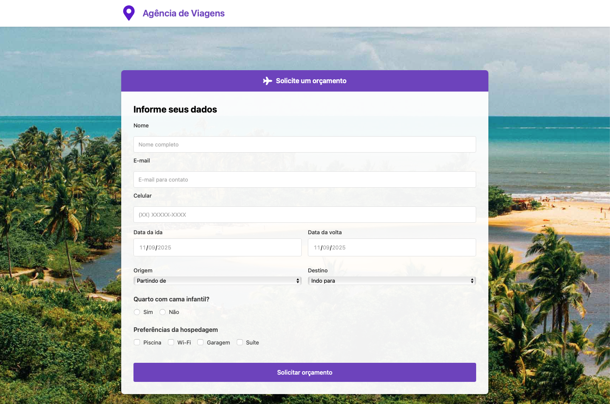

# 🌍 Agência de Viagens

Um site moderno e responsivo para uma agência de viagens, com frontend em HTML/CSS e backend em Laravel para receber orçamentos.



## ✨ Funcionalidades

- **Formulário de Orçamento**: Formulário interativo para solicitação de orçamentos de viagem
- **Galeria de Ofertas**: Exibição visual de destinos em promoção com até 50% de desconto  
- **Seção Natureza**: Cards destacando destinos naturais com preços
- **Design Responsivo**: Layout adaptável para desktop, tablet e mobile
- **Acessibilidade**: Implementação de boas práticas de acessibilidade web
- **API de Orçamentos**: Endpoint para criar e listar orçamentos via Laravel

## 🚀 Tecnologias Utilizadas

- **HTML5**: Estrutura semântica e acessível
- **CSS3**: Estilização moderna com Flexbox e Grid
- **Metodologia BEM**: Nomenclatura consistente para classes CSS
- **Design Responsivo**: Media queries para diferentes dispositivos
- **SEO Otimizado**: Meta tags e estrutura otimizada para mecanismos de busca
- **PHP / Laravel**: Backend para persistência de orçamentos

## 📁 Estrutura do Projeto

```
agencia-viagens/
├── index.html              # Página principal
├── assets/
│   ├── css/
│   │   └── style.css       # Estilos principais
│   └── img/                # Imagens e ícones
│       ├── aviao.png       # Ícone do formulário
│       ├── local-logo.png  # Logo da agência
│       ├── bahia.jpg       # Background do formulário
│       ├── rio.jpg         # Imagem destaque Rio de Janeiro
│       ├── manaus.jpg      # Teatro Amazonas
│       ├── niteroi.jpg     # MAC Niterói
│       ├── saopaulo.jpg    # Skyline São Paulo
│       ├── maranhao.jpg    # Lençóis Maranhenses
│       ├── lencol.jpg      # Card Lençóis Maranhenses
│       ├── goias.jpg       # Cachoeira Santa Bárbara
│       └── Passo-3-layout-finalizado.jpeg  # Layout de referência
├── README.md               # Documentação do projeto
├── backend/                # API em Laravel
└── .gitignore             # Arquivos ignorados pelo Git
```

## 💻 Como Executar

### Pré-requisitos

Apenas um navegador web moderno (Chrome, Firefox, Safari, Edge).

### Frontend (HTML)

1. **Clone o repositório**:
   ```bash
   git clone <url-do-repositorio>
   cd agencia-viagens
   ```

2. **Abra o projeto**:
   - **Opção 1**: Abra o arquivo `index.html` diretamente no navegador
   - **Opção 2**: Use um servidor local:
     ```bash
     # Com Python 3
     python3 -m http.server 8000
     
     # Com Node.js (se tiver live-server instalado)
     npx live-server
     
     # Com PHP
     php -S localhost:8000
     ```

3. **Acesse no navegador**: `http://localhost:8000`

### Backend (Laravel)

1. **Entre na pasta do backend**:
   ```bash
   cd backend
   ```

2. **Configure o ambiente**:
   ```bash
   cp .env.example .env
   composer install
   php artisan key:generate
   php artisan migrate
   ```

3. **Suba o servidor**:
   ```bash
   php artisan serve --host=127.0.0.1 --port=8000
   ```

4. **Endpoints**:
   - `POST http://127.0.0.1:8000/api/orcamentos`
   - `GET http://127.0.0.1:8000/api/orcamentos`

## 📱 Responsividade

O site é totalmente responsivo com breakpoints para:

- **Desktop**: > 768px
- **Tablet**: ≤ 768px  
- **Mobile**: ≤ 480px

### Principais Adaptações Mobile:
- Menu e header otimizados
- Formulário em coluna única
- Galeria de ofertas empilhada
- Cards de destino em layout vertical
- Footer com colunas reorganizadas

## ♿ Acessibilidade

Implementações de acessibilidade incluem:

- **HTML Semântico**: Uso correto de tags `header`, `main`, `section`, `footer`
- **Labels Associadas**: Todos os inputs possuem labels descritivas
- **Alt Text**: Imagens com textos alternativos descritivos
- **Contraste**: Cores com contraste adequado para legibilidade
- **Navegação**: Estrutura lógica e navegável por teclado
- **Fieldsets**: Agrupamento lógico de campos relacionados

## 🔧 Funcionalidades Técnicas

### Formulário de Orçamento
- Validação HTML5 nativa
- Campos obrigatórios marcados
- Tipos de input específicos (email, tel, date)
- Agrupamento com fieldsets e legends
- Action configurada para envio para a API (`/api/orcamentos`)

### Galeria de Ofertas
- Layout assimétrico com imagem destacada
- Grid responsivo para múltiplas imagens
- Hover effects para melhor interatividade

### Cards de Destinos
- Flexbox para layout flexível
- Imagens otimizadas e responsivas
- Informações estruturadas (título, preço)

## 🚀 Melhorias Futuras

Possíveis implementações futuras:

- [ ] JavaScript para validação avançada de formulários
- [ ] Sistema de reservas integrado
- [ ] Carrossel interativo de ofertas
- [ ] Integração com APIs de viagem
- [ ] Sistema de busca de destinos
- [ ] Página de detalhes de destinos
- [ ] Blog de viagens
- [ ] Sistema de avaliações
- [ ] Chat online para atendimento
- [ ] PWA (Progressive Web App)

## 👥 Contribuição

Contribuições são bem-vindas! Para contribuir:

1. Fork o projeto
2. Crie uma branch para sua feature (`git checkout -b feature/AmazingFeature`)
3. Commit suas mudanças (`git commit -m 'Add some AmazingFeature'`)
4. Push para a branch (`git push origin feature/AmazingFeature`)
5. Abra um Pull Request

## 📄 Licença

Este projeto está sob a licença MIT. Veja o arquivo `LICENSE` para mais detalhes.

## 👨‍💻 Autor

**Flávio Pimentel**

---

⭐ Se este projeto foi útil para você, considere dar uma estrela no repositório!
